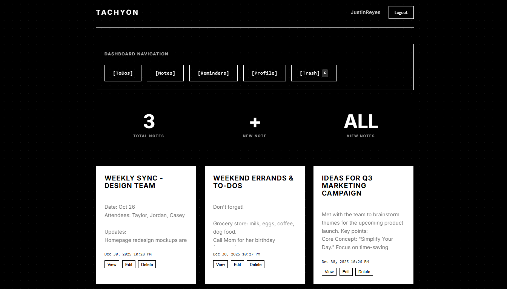
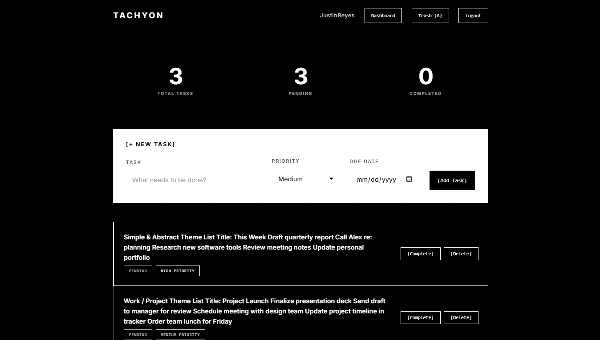
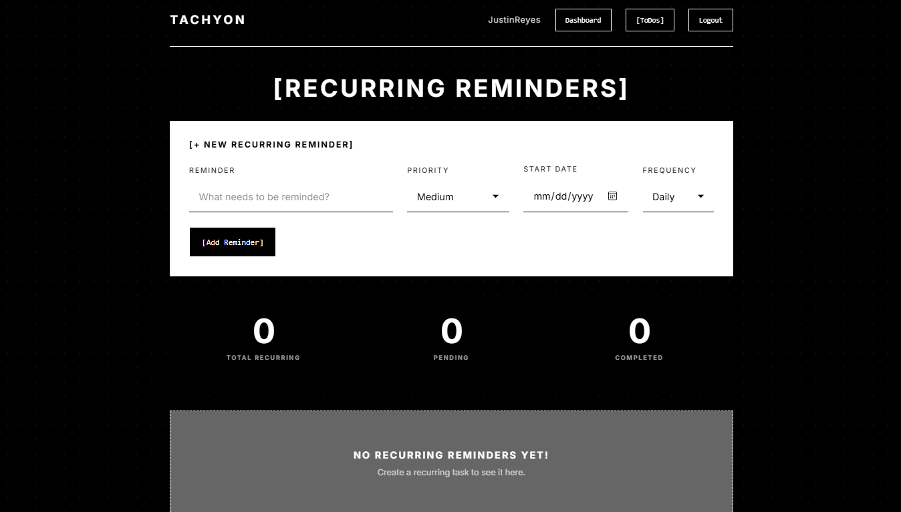
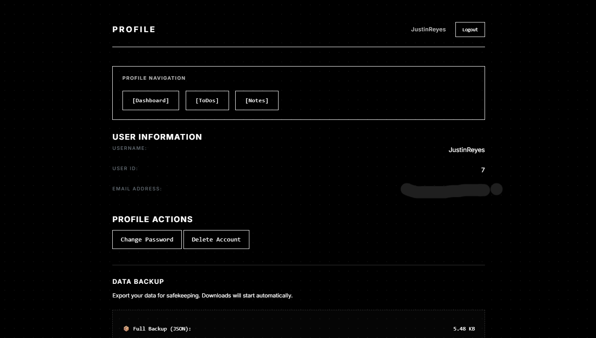
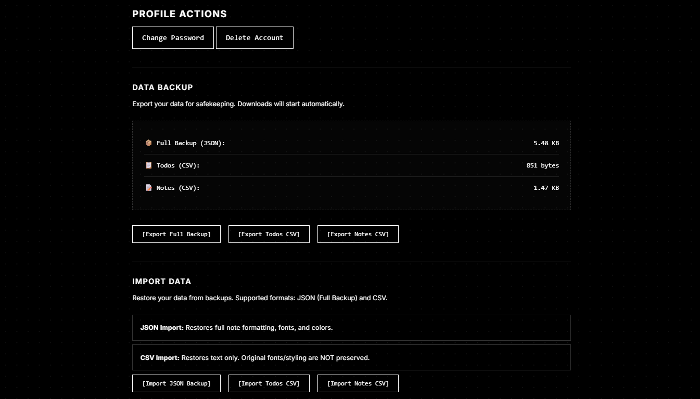
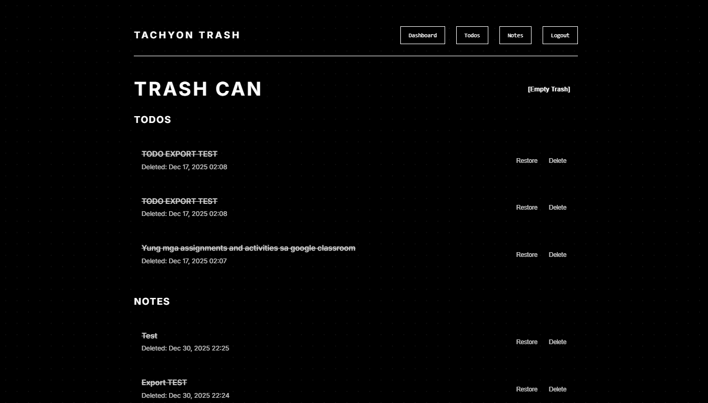

# Tachyon - Advanced ToDo & Notes Application


[](https://tachyon.rf.gd/)

> A feature-rich ToDo and Notes application built with HTML, CSS, JavaScript, PHP, and MySQL database integration. Hosted on InfinityFree with custom authentication system, guest mode, recurring reminders, and comprehensive trash management.

## ✦ Screenshots

<div align="center">

 |  | 
---|---|---
Dashboard | Notes | Login

 |  | 
---|---|---
Todo List | Rich Text Editor | Mobile View

</div>

## ✦ Features

- **🔐 Secure Authentication**: Robust login and registration system with password hashing and token-based verification
- **👤 Guest Mode**: Use the application without registration with local browser storage
- **💾 Persistent Storage**: MySQL database for reliable data storage with automatic backups
- **📱 Responsive Design**: Clean, modern interface accessible on all devices
- **⚡ Dynamic Interactions**: Real-time management powered by JavaScript
- **🛡️ Enhanced Security**: Comprehensive protection against SQL injection, XSS, CSRF, and secure session management
- **📝 Notes Management**: Create, edit, and organize rich text notes with Quill.js editor
- **✨ Rich Text Editing**: Google Notes-like functionality with formatting options
- **🔄 Recurring Reminders**: Daily, weekly, monthly, and yearly recurring task management
- **🗑️ Trash Management**: Soft delete with 30-day recovery window and permanent deletion
- **🔍 Search Functionality**: Quick search across all notes and tasks
- **🎨 Customizable Notes**: Color coding, pinning, and archiving capabilities
- **🚀 Deployed Solution**: Actively hosted on InfinityFree platform
- **📊 Statistics Dashboard**: Quick overview of tasks and notes status

## ✦ Technologies Used

| Technology | Purpose |
|------------|---------|
| **HTML5** | Structuring and content |
| **CSS3** | Styling and responsive layout |
| **JavaScript (ES6+)** | Dynamic functionality & interactivity |
| **PHP 7+** | Server-side processing and business logic |
| **MySQL** | Database management with relational data |
| **Quill.js** | Rich text editor for notes |
| **npm** | Package management for JavaScript dependencies |
| **InfinityFree** | Hosting platform |
| **Git** | Version control |
| **CSRF Tokens** | Cross-Site Request Forgery protection |
| **Prepared Statements** | SQL injection prevention |

## ✦ Project Structure

```
Tachyon-Todo-App/
├── index.php                  # Public landing page with guest mode
├── welcome.php                # Welcome page
├── account.php                # Account management
├── register.php               # User registration
├── login.php                  # User login
├── dashboard.php              # Main dashboard with overview
├── notes.php                  # Notes management dashboard
├── create_note.php            # Create new note with rich editor
├── view_note.php              # View note details
├── edit_note.php              # Edit existing note
├── todos.php                  # Todo management
├── recurring_reminders.php    # Recurring task management
├── trash.php                  # Trash management with recovery
├── profile.php                # User profile management
├── change_password.php        # Password change functionality
├── forgot_password.php        # Password recovery
├── reset_password.php         # Password reset
├── verify_email.php           # Email verification
├── resend_verification.php    # Resend verification email
├── export_backup.php          # Data export functionality
├── import_backup.php          # Data import functionality

├── # API Endpoints
├── add_todo.php               # API: Add new todo
├── complete_todo.php          # API: Mark todo as complete
├── update_todo.php            # API: Update todo
├── delete_todo.php            # API: Soft delete todo
├── permanent_delete_todo.php  # API: Permanent delete todo
├── restore_todo.php           # API: Restore from trash
├── add_recurring.php          # API: Add recurring reminder
├── save_note.php              # API: Save new note
├── update_note.php            # API: Update note
├── delete_note.php            # API: Soft delete note
├── permanent_delete_note.php  # API: Permanent delete note
├── restore_note.php           # API: Restore note from trash
├── empty_trash.php            # API: Empty trash
├── fetch_todos.php            # API: Fetch todos data

├── # Authentication
├── login_process.php          # Handle login logic
├── register_process.php       # Handle registration logic
├── logout.php                 # Handle logout
├── process_forgot_password.php # Password recovery processing
├── process_reset_password.php # Password reset processing
├── verify_code.php            # Verification code handling
├── process_change_password.php # Password change processing
├── verify_change_password.php # Verify password change
├── process_delete_account.php # Account deletion processing
├── verify_delete_account.php  # Verify account deletion

├── # Database
├── db_connect.php             # Database connection
├── setup_database.php         # Database initialization and migrations
├── fix_database.php           # Database repair utility

├── # Configuration
├── config/
│   └── email_config.php       # Email configuration
├── .env                       # Environment variables
├── .htaccess                  # Apache configuration

├── # Assets
├── assets/
│   └── quill/                 # Quill.js editor assets
│       ├── quill.js
│       └── quill.snow.css
├── css/
│   └── style.css              # Main stylesheet
├── js/
│   └── script.js              # Main JavaScript
├── images/                    # Screenshot images
├── templates/                 # Email templates
│   └── email/
│       ├── change_password_code.html
│       ├── delete_account_code.html
│       ├── due_date_reminder.html
│       ├── password_reset.html
│       └── verification_code.html

├── # Utilities
├── cron/                      # Scheduled tasks
│   └── send_due_date_reminders.php
├── includes/                  # Reusable components
│   ├── EmailNotifier.php      # Email notification class
│   ├── functions.php          # Helper functions
│   ├── head.php               # Common head section
├── private_logs/              # Secure logging
│   ├── .gitkeep
│   └── .htaccess

├── # Documentation
├── README.md                  # Project documentation
├── Security.md                # Security requirements
├── LICENSE                    # MIT License
└── package.json               # npm dependencies
```

## ✦ Quick Setup

### Prerequisites
- Web server with PHP 7+ support (Apache/Nginx)
- MySQL database 5.7+
- Node.js and npm (for JavaScript dependencies)
- Web browser

### Installation Steps

1. **Clone the repository**
   ```bash
   git clone https://github.com/yourusername/Tachyon-Todo-App.git
   cd Tachyon-Todo-App
   ```

2. **Install JavaScript dependencies**
   ```bash
   npm install
   ```

3. **Set up your local server** (with Apache and PHP support)

4. **Create .env file**
   Create a `.env` file in the root directory with your database credentials:
   ```env
   DB_HOST=localhost
   DB_USER=your_db_username
   DB_PASS=your_db_password
   DB_NAME=tachyon_todo_app
   ```

5. **Configure Database**
   - Run the database setup script:
   ```bash
   php setup_database.php
   ```
   - This will create the database and tables with proper schema

6. **Update Configuration**
   Modify `db_connect.php` with your database credentials if not using .env:
   ```php
   define('DB_HOST', 'localhost');
   define('DB_USER', 'your_db_username');
   define('DB_PASS', 'your_db_password');
   define('DB_NAME', 'tachyon_todo_app');
   ```

7. **Access the Application**
   Navigate to your web server's document root in a browser

## ✦ Database Schema

The current database schema includes:

### Users Table
```sql
CREATE TABLE users (
    id INT AUTO_INCREMENT PRIMARY KEY,
    username VARCHAR(50) UNIQUE NOT NULL,
    email VARCHAR(255) UNIQUE NOT NULL,
    password_hash VARCHAR(255) NOT NULL,
    password_salt VARCHAR(32) NOT NULL,
    password_changed_at DATETIME(6) DEFAULT CURRENT_TIMESTAMP(6),
    last_password_reset DATETIME(6) NULL,
    failed_login_attempts INT DEFAULT 0,
    locked_until DATETIME(6) NULL,
    is_active BOOLEAN DEFAULT TRUE,
    email_verified BOOLEAN DEFAULT FALSE,
    verification_token VARCHAR(255) NULL,
    reset_token VARCHAR(255) NULL,
    reset_token_expires DATETIME(6) NULL,
    password_reset_token VARCHAR(255) NULL,
    password_reset_token_expires DATETIME(6) NULL,
    password_change_token VARCHAR(255) NULL,
    password_change_token_expires DATETIME(6) NULL,
    account_deletion_token VARCHAR(255) NULL,
    account_deletion_token_expires DATETIME(6) NULL,
    two_factor_secret VARCHAR(255) NULL,
    two_factor_enabled BOOLEAN DEFAULT FALSE,
    created_at DATETIME(6) DEFAULT CURRENT_TIMESTAMP(6),
    updated_at DATETIME(6) DEFAULT CURRENT_TIMESTAMP(6) ON UPDATE CURRENT_TIMESTAMP(6),
    last_login DATETIME(6) NULL
);
```

### Todos Table (with trash support)
```sql
CREATE TABLE todos (
    id INT AUTO_INCREMENT PRIMARY KEY,
    user_id INT NOT NULL,
    title VARCHAR(255) NOT NULL,
    description TEXT,
    priority ENUM('low', 'medium', 'high') DEFAULT 'medium',
    status ENUM('pending', 'in_progress', 'completed') DEFAULT 'pending',
    due_date DATE,
    recurring ENUM('none', 'daily', 'weekly', 'monthly', 'yearly') DEFAULT 'none',
    created_at TIMESTAMP DEFAULT CURRENT_TIMESTAMP,
    updated_at TIMESTAMP DEFAULT CURRENT_TIMESTAMP ON UPDATE CURRENT_TIMESTAMP,
    is_trashed BOOLEAN DEFAULT FALSE,
    trashed_at DATETIME NULL,
    FOREIGN KEY (user_id) REFERENCES users(id) ON DELETE CASCADE
);
```

### Notes Table (with trash support)
```sql
CREATE TABLE notes (
    id INT AUTO_INCREMENT PRIMARY KEY,
    user_id INT NOT NULL,
    title VARCHAR(255) NOT NULL,
    content LONGTEXT,
    color VARCHAR(7) DEFAULT '#ffffff',
    is_pinned BOOLEAN DEFAULT FALSE,
    is_archived BOOLEAN DEFAULT FALSE,
    created_at TIMESTAMP DEFAULT CURRENT_TIMESTAMP,
    updated_at TIMESTAMP DEFAULT CURRENT_TIMESTAMP ON UPDATE CURRENT_TIMESTAMP,
    is_trashed BOOLEAN DEFAULT FALSE,
    trashed_at DATETIME NULL,
    FOREIGN KEY (user_id) REFERENCES users(id) ON DELETE CASCADE
);
```

## ✦ Live Demo

Experience Tachyon in action: [https://tachyon.rf.gd/](https://tachyon.rf.gd/)

## ✦ Security Features

- **CSRF Protection**: Cross-Site Request Forgery tokens on all state-changing operations
- **Input Sanitization**: Comprehensive input validation and output escaping
- **SQL Injection Prevention**: Prepared statements for all database operations
- **Secure Session Management**: Token-based authentication with expiration
- **Password Security**: Strong hashing with salt using PHP's `password_hash()`
- **Trash Auto-Cleanup**: Automatic permanent deletion of trashed items after 30 days
- **Environment Variables**: Secure configuration management via .env files
- **HTTPS Enforcement**: Secure connections via .htaccess configuration
- **Proper Authentication Checks**: Authorization verification on all protected pages
- **Error Handling**: Secure error reporting without exposing sensitive information

## ✦ Key Enhancements from Original Version

### 🆕 New Features Added
- **Guest Mode**: Full functionality without registration using localStorage
- **Recurring Reminders**: Daily, weekly, monthly, and yearly task repetition
- **Trash System**: Soft deletion with recovery window and auto-cleanup
- **Enhanced Security**: CSRF tokens, improved session management
- **Search Functionality**: Quick filtering of notes
- **Email Verification**: Secure account activation workflow
- **Password Recovery**: Comprehensive password reset system
- **Account Management**: Profile updates, password changes, account deletion
- **Data Export/Import**: Backup and restore functionality
- **Auto-Cleanup**: Scheduled removal of old trashed items

### 🔧 Technical Improvements
- **Modern Database Schema**: Added trash support, recurring fields, and enhanced user fields
- **Improved Project Structure**: Better organization with clear separation of concerns
- **Enhanced Error Handling**: Comprehensive logging and user-friendly messages
- **Mobile Optimization**: Improved responsive design
- **Performance Optimizations**: Efficient database queries and caching
- **Accessibility Improvements**: Better UI/UX across all devices

## ✦ Contributing

Contributions are welcome! Here's how you can contribute:

1. Fork the repository
2. Create a feature branch (`git checkout -b feature/amazing-feature`)
3. Make your changes
4. Commit your changes (`git commit -m 'Add amazing feature'`)
5. Push to the branch (`git push origin feature/amazing-feature`)
6. Open a Pull Request

## ✦ License

This project is licensed under the MIT License - see the [LICENSE](LICENSE) file for details.

## ✦ Contact

Tachyon ToDo Application
- Hosted at: [https://tachyon.rf.gd/](https://tachyon.rf.gd/)
- Built with ❤️ using modern web technologies

## ✦ Support

If you find this project helpful, please give it a star! It helps others discover the project and motivates continued development.